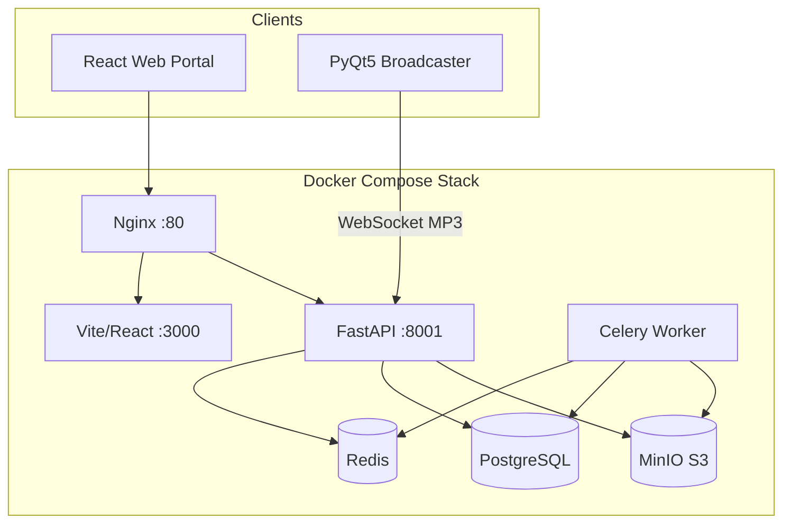

# VeriSonic

VeriSonic is a high-fidelity audio platform for **lossless music streaming**, **live radio broadcasting**, and **studio-grade catalog management**. It combines a React web portal, a FastAPI backend with Celery processing, and a PyQt5 desktop broadcaster for real-time station ingest.

---

## Features

### Listeners
- **Home Feed** — recently played, trending tracks, popular artists (mobile tile/scroll layouts)
- **Radio Stations** — browse live and external stations; compact mobile tiles with location and frequency
- **Search** — tracks and radio with filters, recent searches, and trending queries
- **Favorites & Playlists** — sync favorites to the API; create playlists with drag-reorder
- **Global audio player** — queue, lyrics, shuffle/repeat, playback speed, quality tiers, MediaSession
- **Mobile-first UI** — bottom navigation, expanded full-screen player, banner notifications

### Studio admins
- Upload lossless audio (FLAC/WAV/AIFF/ALAC) with automatic metadata extraction
- Celery pipeline: spectral analysis, quality scoring, spectrogram, FFmpeg transcoding (MP3/AAC/HLS)
- Track management, approval workflow, OpenAI Whisper lyrics transcription (optional)
- Studio profile and reactivation appeals

### Radio admins
- Register and manage radio station nodes (profile, location, frequency, programs)
- **Live broadcast** via desktop broadcaster (WebSocket MP3 ingest → HTTP/WebRTC listeners)
- Stream key generation/regeneration (time-limited OTP-style keys)
- Program schedule editor with timezone-aware active program detection
- Admin/listener mode toggle

### Platform admins
- User management (roles, subscriptions)
- Studio and station moderation (enable/disable, reactivation)
- Analytics dashboard (plays, bandwidth, quality distribution)
- Acoustic quality reports with admin approve/reject

### Subscriptions
- Free (7-day trial), Premium, Unlimited tiers
- Non-premium: 30s track preview, 60s radio preview, AAC 128 only
- Premium: full playback and higher quality streams

---

## Architecture



**Live radio path:** Broadcaster → `WS /api/radio/stream/ws` → `LiveStreamManager` (in-memory + optional Redis fan-out) → listeners via `GET /api/radio/{id}/live` or WebRTC.

**Music path:** Upload → Celery analyze → quality score → transcode → S3 → HLS/MP3/AAC playback in browser.

---

## Repository layout

```text
verisonic/
├── backend/                 # FastAPI API, WebSockets, Celery tasks, services
│   ├── app/
│   │   ├── api/             # auth, music, radio, playlist, favorites, analytics
│   │   ├── db/              # migrations runner
│   │   ├── services/        # storage, live_stream, audio analysis
│   │   └── tasks/           # Celery analyze + transcode
│   └── tests/
├── frontend/                # Vite + React + TypeScript + Tailwind
│   └── src/
│       ├── pages/           # Home, Radio, Search, Playlists, admin pages, …
│       ├── components/      # player, layout, shared UI
│       └── context/         # AuthContext, AudioContext
├── broadcaster/             # PyQt5 desktop live broadcaster
├── .github/workflows/       # backend-tests.yml, build-broadcaster.yml
├── docker-compose.yml
├── nginx.conf
└── implementation_plan.md   # Living spec & implementation status
```

---

## Getting started

### Prerequisites
- [Docker & Docker Compose](https://www.docker.com/)
- Python 3.10+ (local broadcaster or backend dev)
- Node.js 18+ (frontend dev outside Docker)

### 1. Start the stack

```bash
docker compose up --build
```

| Service | URL |
|---------|-----|
| Web portal | http://localhost:3000 |
| API docs | http://localhost:3000/docs |
| MinIO console | http://localhost:9001 (`minioadmin` / `minioadmin`) |

### 2. Default admin account

On first startup the backend seeds:

- **Email:** `admin@verisonic.com`
- **Password:** `admin12345`

Use this to promote users to studio/radio admin roles.

### 3. Desktop broadcaster (local dev)

```bash
python -m pip install -r broadcaster/requirements.txt
python broadcaster/verisonic_broadcaster.py
```

Only **radio admin** accounts can broadcast. Copy the stream key from the Radio Stations dashboard (Connection Settings).

Packaging and CI builds: see [broadcaster/distributing_broadcaster.md](broadcaster/distributing_broadcaster.md).

---

## Development

### Backend tests

```bash
cd backend && pytest tests/ -v
```

CI runs on push/PR when `backend/**` changes (`.github/workflows/backend-tests.yml`).

### Frontend dev (outside Docker)

```bash
cd frontend
npm install
npm run dev
```

The Vite dev server proxies `/api` to the backend.

### Environment variables

Key backend settings (see `docker-compose.yml`):

- `POSTGRES_*`, `REDIS_HOST`, `S3_ENDPOINT_URL`
- `SECRET_KEY`, `OPENAI_API_KEY` (optional, for lyrics transcription)

---

## User roles

| Role | Capabilities |
|------|----------------|
| `listener` | Browse, play, favorites, playlists, search |
| `studio_admin` | Upload/manage tracks, studio profile |
| `radio_admin` | Own station(s), live broadcast, program schedule |
| `admin` | Full platform management |

Staff roles support **Admin mode** vs **Listen mode** (toggle in header). Playlists and library playback are disabled in admin mode.

---

## Documentation

| Document | Purpose |
|----------|---------|
| [implementation_plan.md](implementation_plan.md) | Technical spec, API summary, implementation status, gaps |
| [walkthrough.md](walkthrough.md) | Live broadcaster setup walkthrough |
| [broadcaster/distributing_broadcaster.md](broadcaster/distributing_broadcaster.md) | Build & distribute desktop broadcaster |

---

## License

Proprietary — VeriSonic project.
