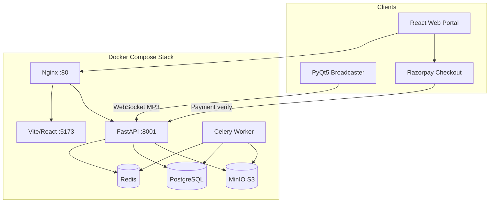

# VeriSonic

VeriSonic is a high-fidelity audio platform for **lossless music streaming**, **live radio broadcasting**, **studio-grade catalog management**, and **owner revenue sharing**. It combines a React web portal, a FastAPI backend with Celery processing, Razorpay subscription checkout, owner wallets, and a PyQt5 desktop broadcaster for real-time station ingest.

---

## Features

### Listeners
- **Home Feed** — recently played, trending tracks, popular artists (click artist → search)
- **Radio Stations** — browse live and external stations; tiles with cover art, frequency, location
- **Search** — header dropdown preview + full search page (tracks, albums, radio, artists, playlists); detail views and Play All
- **Favorites & Playlists** — sync favorites to the API; create playlists with drag-reorder
- **Global audio player** — queue, lyrics, shuffle/repeat, playback speed, quality tiers, MediaSession
- **Mobile-first UI** — bottom navigation, expanded full-screen player, banner notifications

### Studio admins
- Studio profile onboarding (`profile_complete` gate before track management)
- **Studio cover image** and licence document upload
- Upload lossless audio (FLAC/WAV/AIFF/ALAC) with automatic metadata extraction
- Celery pipeline: spectral analysis, quality scoring, spectrogram, FFmpeg transcoding (MP3/AAC/HLS)
- Track management, approval workflow, OpenAI Whisper lyrics transcription (optional)
- Reactivation appeals when profile is disabled
- **My Wallet** — earnings from billable track plays, withdrawals

### Radio admins
- Register and manage radio station nodes (profile, location, frequency, programs)
- **Station cover image** and licence document upload (shown in radio listings & search)
- **Live broadcast** via desktop broadcaster (WebSocket MP3 ingest → HTTP/WebRTC listeners)
- Stream key generation/regeneration (time-limited OTP-style keys)
- Program schedule editor with timezone-aware active program detection
- **My Wallet** — earnings from radio listen sessions, withdrawals
- Admin/listener mode toggle

### Platform admins
- User management (roles, subscriptions)
- **Studios Management** and **Radio Stations Management** — moderation, licence doc review
- Analytics dashboard (plays, bandwidth, quality distribution)
- Acoustic quality reports with admin approve/reject
- **Accounts** — overview, owners, withdrawals (view/export + date filters), subscriptions (view/export + date filters), revenue settings
- Owner withdrawals are **instant self-service** (Accounts is view-only for payouts)
- Mandatory password reset gate for seeded admin account

### Subscriptions
- **Free** — 7-day full-access trial, then 30s track preview / 60s radio preview / AAC 128 only
- **Premium** — full playback, higher quality streams (MP3 320, AAC 256, lossless master)
  - Self-service via Razorpay: Premium Monthly (₹99) or Premium Yearly (₹999)
  - Plan changes can be queued for end of billing period; cancel-at-period-end supported
- **Unlimited** — admin-assigned only (no checkout; never auto-downgraded on payment failure)
- Checkout UI: Landing page pricing, Settings, and in-player Premium modal

### Account & profiles
- **My Profile** — display name, email, password; hover initials circle → upload display picture
- Initials avatar derived from display name when no photo is set

---

## Architecture



**Live radio path:** Broadcaster → `WS /api/radio/stream/ws` → `LiveStreamManager` → listeners via `GET /api/radio/{id}/live` or WebRTC.

**Music path:** Upload → Celery analyze → quality score → transcode → S3 → HLS/MP3/AAC playback. Lossless master streams use short-lived tickets.

**Revenue path:** Premium listens → billable track plays / radio sessions → owner wallet → **instant withdrawal** (paid) → Accounts admin view/export.

**Subscription path:** Client → Razorpay Checkout → `POST /api/subscriptions/verify` → plan activated.

---

## Repository layout

```text
verisonic/
├── BUILD_GUIDE.md           # Full rebuild blueprint (layout + every feature)
├── backend/                 # FastAPI API, WebSockets, Celery tasks, services
│   ├── app/
│   │   ├── api/             # auth, music, radio, playlist, favorites, analytics,
│   │   │                    # subscriptions, wallet, revenue_admin, discovery, catalog
│   │   ├── core/            # config, premium gating, subscription plans, security, upload validation
│   │   ├── db/              # migrations runner
│   │   ├── services/        # storage, live_stream, wallet, razorpay, accounts CSV export
│   │   └── tasks/           # Celery analyze + transcode
│   └── scripts/             # seed_accounts_test_data, reset helpers
├── frontend/                # Vite + React + TypeScript + Tailwind
│   └── src/
│       ├── pages/           # Home, Radio, Search, Wallet, Accounts, admin pages, …
│       ├── components/      # player, layout (HeaderSearch), wallet, subscription, shared UI
│       ├── context/         # AuthContext, AudioContext
│       └── utils/           # searchMatch, subscriptionCheckout, streamQuality, wallet
├── broadcaster/             # PyQt5 desktop live broadcaster
├── .github/workflows/       # backend-tests.yml, build-broadcaster.yml
├── docker-compose.yml
├── nginx.conf
├── implementation_plan.md   # Living spec & implementation status
└── task.md                  # Feature checklist
```

---

## Getting started

### Prerequisites
- [Docker & Docker Compose](https://www.docker.com/)
- Python 3.10+ (local broadcaster or backend dev)
- Node.js 18+ (frontend dev outside Docker)

### 1. Start the stack

```bash
docker compose up --build
```

| Service | URL |
|---------|-----|
| Web portal | http://localhost:3000 |
| API docs (development) | http://localhost:8001/docs |
| MinIO console | http://localhost:9001 (`minioadmin` / `minioadmin`) |

Nginx listens on port 3000 and proxies `/api` to FastAPI (8001). FastAPI's development-only OpenAPI UI is exposed directly on port 8001; `/docs` on port 3000 is handled by the frontend proxy.

### 2. Default admin account

On first startup the backend seeds this local-development account:

- **Email:** `admin@verisonic.com`
- **Password:** `admin12345`

Use this to log in as platform admin. You will be prompted to set a new password before admin features are unlocked. Do not use these credentials in a deployed environment.

Use this account to promote users to studio/radio admin roles and assign subscription tiers.

### 3. Desktop broadcaster (local dev)

```bash
python -m pip install -r broadcaster/requirements.txt
python broadcaster/verisonic_broadcaster.py
```

Only **radio admin** accounts can broadcast. Copy the stream key from the Radio Stations dashboard (Connection Settings).

Packaging and CI builds: see [broadcaster/distributing_broadcaster.md](broadcaster/distributing_broadcaster.md).

### 4. Subscriptions (optional)

To enable Razorpay checkout, set these in `docker-compose.yml` or your environment:

```yaml
RAZORPAY_KEY_ID: your_key_id
RAZORPAY_KEY_SECRET: your_key_secret
```

Without keys, plan listing works but checkout returns a configuration error.

### 5. Accounts demo data (optional)

```bash
docker exec -w /app verisonic_backend env PYTHONPATH=/app \
  python scripts/seed_accounts_test_data.py
```

Use `--reset` to wipe prior demo users first. Demo emails use `@accounts-demo.verisonic.local` (password `demo12345`).

---

## Development

### Backend tests

```bash
cd backend && pytest tests/ -v
```

CI runs on push/PR when `backend/**` changes (`.github/workflows/backend-tests.yml`).

### Frontend dev (outside Docker)

```bash
cd frontend
npm install
npm run dev
```

The Vite dev server proxies `/api` to the backend.

### Environment variables

Copy the safe template before configuring a non-default environment:

```bash
cp .env.example .env
```

Key backend settings (see `.env.example`, `docker-compose.yml`, and `backend/app/core/config.py`):

- `POSTGRES_*`, `REDIS_HOST`, `S3_ENDPOINT_URL`
- `SECRET_KEY` — required in production (32+ characters)
- `ENVIRONMENT` — set to `production` in deployed environments (forces Redis for refresh tokens)
- `CORS_ORIGINS` — comma-separated allowed web origins
- `RAZORPAY_KEY_ID`, `RAZORPAY_KEY_SECRET` — enable Premium checkout (INR)
- Email settings (optional, for withdrawal CSV email export)

**Production checklist:** set `ENVIRONMENT=production`, a strong `SECRET_KEY`, strong database/MinIO credentials, Razorpay live keys, and restrict service ports.

---

## User roles

| Role | Capabilities |
|------|----------------|
| `listener` | Browse, play, favorites, playlists, search, subscribe |
| `studio_admin` | Upload/manage tracks, studio profile, cover & licence uploads, wallet |
| `radio_admin` | Own station(s), live broadcast, station cover & licence, program schedule, wallet |
| `admin` | Users, Accounts, studios/stations moderation, analytics, reports, revenue settings |

Staff roles support **Admin mode** vs **Listen mode** (toggle in header). Playlists and header search are disabled in admin mode.

---

## Profiles & cover images

| What | Where to update |
|------|-----------------|
| Display picture | **My Profile** — hover the initials circle → camera icon → upload |
| Studio cover | **Studio Profile** → Core Info → Studio Cover (save profile first) |
| Radio station cover | **Station Profile** → edit station → Station Cover |

Radio station covers appear in browse and search listings automatically.

---

## Documentation

| Document | Purpose |
|----------|---------|
| **[BUILD_GUIDE.md](BUILD_GUIDE.md)** | **Complete rebuild blueprint** — same layout, every role/feature, APIs, data model, build order, acceptance checklist |
| [implementation_plan.md](implementation_plan.md) | Technical spec, API summary, migrations, implementation status, gaps |
| [task.md](task.md) | Completed feature checklist and open items |
| [walkthrough.md](walkthrough.md) | Live broadcaster setup walkthrough |
| [broadcaster/distributing_broadcaster.md](broadcaster/distributing_broadcaster.md) | Build & distribute desktop broadcaster |

---

## License

Proprietary — VeriSonic project.
