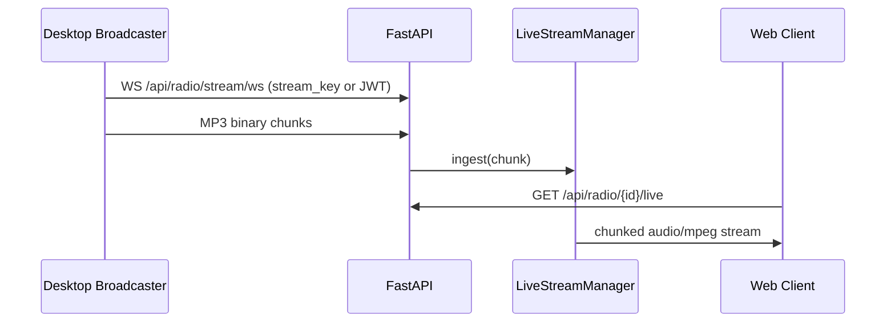
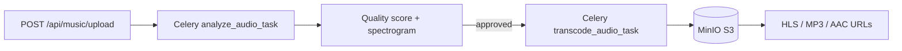

# VeriSonic — Implementation Plan & Technical Spec

Living document describing what is **implemented today**, how the system works, and known gaps. Last aligned with the codebase: July 2026.

---

## 1. Product overview

VeriSonic is a full-stack audio platform:

1. **Music catalog** — lossless uploads, automated quality analysis, multi-bitrate transcoding, HLS VOD playback
2. **Live radio** — desktop broadcaster ingest, real-time listener delivery, station profiles and program schedules
3. **Consumer experience** — web player with queue, lyrics, favorites, playlists, search, mobile-first navigation
4. **Administration** — user/role management, studio & station moderation, analytics

---

## 2. Architecture

### 2.1 Why WebSockets for live broadcast (not webhooks)

Webhooks are stateless HTTP callbacks suited for discrete events. Live audio requires a **persistent, low-overhead, bidirectional** channel. The desktop broadcaster streams continuous MP3 frames over WebSocket; the server fans them out to listener queues.



### 2.2 Music processing pipeline



### 2.3 Frontend shell

- Hash-based tab routing (`#home`, `#radio`, …) in `App.tsx` — no React Router
- Global state: `AuthContext` (user, role, admin/listener mode), `AudioContext` (player, queue, favorites)
- Layout: `Header` (desktop nav + mobile app bar), `MobileNav` (bottom tabs), `AudioPlayer`, `OptionalPanel` (queue/programs)

---

## 3. Backend — implemented

### 3.1 Stack

| Component | Technology |
|-----------|------------|
| API | FastAPI, Uvicorn |
| ORM | SQLAlchemy + PostgreSQL |
| Tasks | Celery + Redis |
| Storage | MinIO (S3-compatible) |
| Live audio | WebSocket ingest, HTTP chunked MP3, WebRTC (aiortc) |
| Auth | JWT + Redis refresh tokens, bcrypt |

### 3.2 Database models (13 tables)

`User`, `Artist`, `Album`, `Genre`, `Track`, `Playlist`, `PlaylistTrack`, `RadioStation`, `RadioSchedule`, `ListeningHistory`, `Favorite`, `AudioAnalysisReport`, `StreamingLog`

Migrations: custom runner in `backend/app/db/migrations.py` (001–007).

### 3.3 API modules

| Prefix | Module | Status |
|--------|--------|--------|
| `/api/auth` | Registration, login, refresh, profile, admin user/studio management | ✅ |
| `/api/music` | Upload, CRUD, search, quality, approve, play logging, transcribe, WS status | ✅ |
| `/api/radio` | Stations CRUD, live ingest/playback, stream key, WebRTC, schedule add | ✅ partial schedule |
| `/api/playlist` | CRUD, add/remove/reorder tracks | ✅ |
| `/api/favorites` | List, add, remove | ✅ |
| `/api/analytics` | Admin dashboard metrics | ✅ |

### 3.4 Live streaming (implemented)

| Endpoint | Purpose |
|----------|---------|
| `WS /api/radio/stream/ws` | Broadcaster ingest (MP3 chunks) |
| `GET /api/radio/{id}/live` | HTTP listener stream (`audio/mpeg`) |
| `WS /api/radio/{id}/stream/ws/listener` | WebSocket listener |
| `POST /api/radio/{id}/webrtc/listener` | WebRTC relay |
| `POST /api/radio/{id}/regenerate-key` | Rotate stream key (5-minute validity) |

`LiveStreamManager` (`app/services/live_stream.py`):
- In-memory listener queues + chunk ring buffer
- Optional Redis pub/sub for multi-instance fan-out
- Listener count aggregation
- Dynamic program/RJ from `programs_list` JSON + station timezone

**Intentional behavior:** No Auto-DJ / scheduled track playback when broadcaster is offline. External `stream_url` can still mark a station online.

### 3.5 Auth & access control

- Roles: `listener`, `studio_admin`, `radio_admin`, `admin`
- Header `X-User-Mode: listener` for staff browsing as listener
- Rate limit: login/register 10 req/min per IP
- Password policy: 8+ chars, letter + number
- Premium gating: preview limits, quality tier restrictions

### 3.6 Celery tasks

1. **`analyze_audio_task`** — FFprobe metadata, librosa spectral analysis, spectrogram PNG, quality scoring, auto-reject rules
2. **`transcode_audio_task`** — MP3 320, AAC 256/128, HLS VOD segments → S3

### 3.7 Tests (CI)

- `tests/test_api_health.py`
- `tests/test_audio_quality.py`
- `tests/test_live_stream_manager.py`

---

## 4. Frontend — implemented

### 4.1 Pages (tab routes)

| Tab | Page | Notes |
|-----|------|-------|
| `landing` | LandingPage | Marketing, pricing, featured content |
| `home` | Home | Feed with mobile tiles & horizontal scroll |
| `radio` | Radio | Listener tiles; admin dashboard & registration |
| `search` | Search | Debounced search, filters, recent/trending |
| `favorites` | Favorites | API-backed favorites list |
| `playlists` | Playlist | CRUD, drag-reorder, mobile drill-down |
| `details` | MusicDetails | Track detail, lyrics, share |
| `profile` | UserProfile | Profile & password |
| `station-profile` | StationProfile | Radio station management |
| `studio-profile` | StudioProfile | Studio management |
| `settings` | Settings | Quality, VIP UI, stream key (radio admin) |
| `tracks` | TracksManagement | Upload queue, approval, acoustic reports |
| `users` | UsersManagement | Admin user CRUD |
| `analytics` | AdminAnalytics | Metrics dashboard |
| `reports` | Inline in App | Acoustic report viewer |
| `contact` | Contact | Support & upgrade requests |
| `broadcaster-download` | BroadcasterDownload | Desktop app download guide |
| `auth` | AuthPage | Login / register / social stub |

**Not wired:** `Artist.tsx`, `Sidebar.tsx` (legacy; navigation uses Header + MobileNav).

### 4.2 Audio player

| Feature | Desktop | Mobile |
|---------|---------|--------|
| Mini player bar | Fixed bottom overlay | In-flow above bottom nav |
| Expanded player | — | Full-screen deck, browser back to dismiss |
| Queue / Programs panel | Right drawer | Full-screen bottom sheet |
| Lyrics | Modal | Tap cover → overlay in expanded player |
| Speed control | Select dropdown | Chevrons + tap speed to reset 1× |
| Visualizer | Canvas spectrum (Equalizer) | — |
| Live radio sync | 24h seek bar, edge sync | Same |

### 4.3 Mobile UI patterns

- **Header:** compact circular logo (left), centered page title, circular avatar (right)
- **Bottom nav:** Home, Radio, Search, Favorites, Playlists (role-aware)
- **Home feed:** horizontal scroll strips; trending 3×3 paged grids
- **Radio (listener):** compact tiles — name + frequency row, location below
- **Notifications:** banner toasts for errors/info/success; Swal retained for confirmations only
- **Track lists:** full-width `TrackRow` (matches playlist layout)

### 4.4 Route guards

- Unauthenticated → `landing`
- `radio_admin` without station → restricted tabs until station registered
- Admin mode → playlists disabled; library playback stopped; radio admin cannot play other stations

---

## 5. Desktop broadcaster — implemented

**Location:** `broadcaster/verisonic_broadcaster.py` (PyQt5 primary UI, Tkinter fallback)

| Feature | Status |
|---------|--------|
| Audio device selection | ✅ |
| WebSocket MP3 streaming | ✅ |
| Stream key / JWT auth | ✅ |
| VU meter, status, duration | ✅ |
| Radio-admin-only login | ✅ |
| PyInstaller CI builds (macOS, Linux, Windows) | ✅ `.github/workflows/build-broadcaster.yml` |

---

## 6. Known gaps & future work

| Area | Gap |
|------|-----|
| Radio schedule | Add-only API; no list/delete/reorder; no automated scheduled playback |
| Playlists | `is_public` stored but no public discovery endpoint |
| Artists | `Artist.tsx` page exists but not routed; search “artists” filter has no dedicated view |
| Listening history | Written on play; no user-facing history API/page |
| Google OAuth | Mock endpoint only; no real token verification |
| Station reactivation | Model fields exist; studio has appeal API; radio station appeal endpoint incomplete |
| Payments | VIP upgrade UI only; no payment provider integration |
| Track comments | Client-side mock on MusicDetails; not persisted |
| Album/genre CRUD | Models exist; no standalone management APIs |

---

## 7. Verification checklist

### Live broadcast
1. Start stack: `docker compose up --build`
2. Log in as radio admin, register a station
3. Open Connection Settings → copy stream key
4. Run `python broadcaster/verisonic_broadcaster.py`, authenticate, start broadcast
5. Confirm station shows **Live** in dashboard; play station in web player

### Music upload
1. Promote user to studio admin
2. Upload lossless file via Tracks Management
3. Wait for Celery analysis + transcode
4. Approve track (admin) if not auto-approved
5. Play from Home or Search

### Mobile smoke test
1. Open portal on narrow viewport
2. Verify bottom nav, expanded player, queue full-screen sheet
3. Verify banner on offline station tap (not blocking Swal modal)
4. Verify Home trending 3×3 scroll and Radio tile strip

### Automated
```bash
cd backend && pytest tests/ -v
```

---

## 8. Default seed data

| Item | Value |
|------|-------|
| Admin email | `admin@verisonic.com` |
| Admin password | `admin12345` |
| Genres | Rock, Electronic, Classical, Jazz, Hip-Hop, Ambient |

---

## 9. File reference (key paths)

| Area | Path |
|------|------|
| API entry | `backend/app/main.py` |
| Radio + live stream | `backend/app/api/radio.py`, `backend/app/services/live_stream.py` |
| Music + upload | `backend/app/api/music.py`, `backend/app/tasks/tasks.py` |
| Migrations | `backend/app/db/migrations.py` |
| App router | `frontend/src/App.tsx` |
| Player | `frontend/src/components/player/AudioPlayer.tsx` |
| Audio state | `frontend/src/context/AudioContext.tsx` |
| Auth state | `frontend/src/context/AuthContext.tsx` |
| Banner notifications | `frontend/src/components/shared/BannerHost.tsx`, `frontend/src/utils/banner.ts` |
| Confirm dialogs | `frontend/src/utils/swal.ts` |
| Broadcaster | `broadcaster/verisonic_broadcaster.py` |
