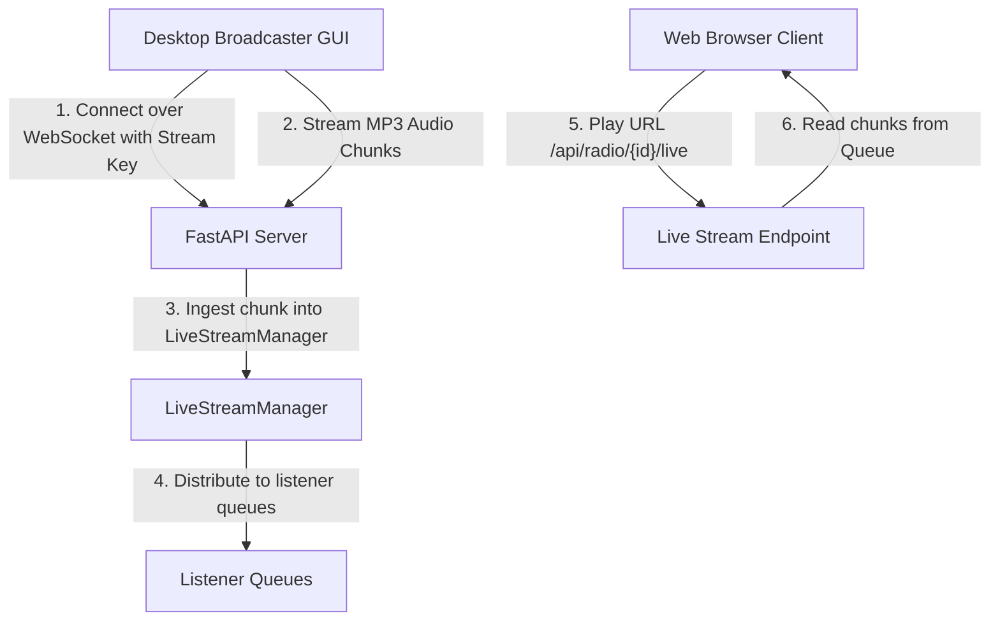

# Implementation Plan - VeriSonic Live Broadcaster System

This plan details the implementation of a real-time live broadcasting system for VeriSonic, consisting of a Python desktop broadcaster application, backend streaming ingestion over WebSockets, and frontend radio station controls.

---

## Technical Design & Recommended Connection Option

### Why WebSockets over Webhooks?
* **Webhooks** are unidirectional HTTP POST callbacks designed for sending event notifications (e.g., webhook triggered when a user registers). They are stateless and completely unsuitable for sending continuous, real-time binary audio data.
* **WebSockets** are bi-directional, full-duplex, persistent TCP connections with minimal overhead. By using WebSockets, the desktop broadcaster can capture audio from any local input device, encode it, and stream continuous binary audio frames with sub-second latency. The server then distributes these frames to active listeners instantly.

### Architecture Overview


1. **Database Schema Update**: Add a `stream_key` column to `RadioStation` to act as a unique connection credential.
2. **WebSocket Ingestion (`/api/radio/stream/ws`)**: A persistent endpoint that receives audio chunks from the authenticated desktop broadcaster and sends them to the `LiveStreamManager`.
3. **Live Stream Manager**: An in-memory broker inside the FastAPI server that routes incoming audio packets to client request streams.
4. **Live Playing Endpoint (`/api/radio/{id}/live`)**: An HTTP endpoint that uses FastAPI's `StreamingResponse(media_type="audio/mpeg")` so browsers can play the stream natively using the standard HTML5 `<audio>` player.
5. **Web Control Interface**: An updated Radio dashboard on the React frontend displaying the custom Stream URL and Stream Key with copy/regenerate controls.
6. **Desktop Broadcaster (Tkinter Python App)**: A lightweight, user-friendly desktop application to select audio input devices, configure server settings/keys, encode PCM audio to MP3 using LAME, and stream directly.

---

## User Review Required

> [!IMPORTANT]
> The desktop application requires standard Python audio capture dependencies: `sounddevice`, `numpy`, `lameenc` (for MP3 encoding), and `websocket-client`. Fallback instructions will be provided in case `lameenc` or other C-based libraries are missing.

---

## Proposed Changes

### Database & Backend Configurations

#### [MODIFY] [models.py](file:///Users/charlsonpeter/Documents/Projects/My_Projects/verisonic/backend/app/models.py)
* Add `stream_key` field to the `RadioStation` database model:
  ```python
  stream_key = Column(String, unique=True, index=True, nullable=True)
  ```

#### [MODIFY] [schemas.py](file:///Users/charlsonpeter/Documents/Projects/My_Projects/verisonic/backend/app/schemas.py)
* Add `stream_key` field to `RadioStationResponse` to make it accessible to radio administrators.

#### [MODIFY] [main.py](file:///Users/charlsonpeter/Documents/Projects/My_Projects/verisonic/backend/app/main.py)
* Add an automatic database migration inside the `startup_seeder` function to create the `stream_key` column if it is missing on startup.

---

### Backend API Endpoints

#### [MODIFY] [radio.py](file:///Users/charlsonpeter/Documents/Projects/My_Projects/verisonic/backend/app/api/radio.py)
* Implement `LiveStreamManager` broker to handle real-time audio distribution to listeners.
* Implement a WebSocket endpoint `/api/radio/stream/ws` that accepts `stream_key` as a query parameter, authenticates, and ingests audio chunks.
* Implement HTTP streaming endpoint `/api/radio/{id}/live` that reads audio chunks from the stream manager queue and returns them with headers configured for live MP3 playback.
* Add `POST /api/radio/{id}/regenerate-key` endpoint to allow owners to regenerate their station's stream key.
* Update `get_station_stream_sync` and `serialize_station` to detect when a station is live-broadcasting and automatically return the internal `/api/radio/{id}/live` stream URL.

---

### React Frontend Interface

#### [MODIFY] [Radio.tsx](file:///Users/charlsonpeter/Documents/Projects/My_Projects/verisonic/frontend/src/pages/Radio.tsx)
* Enhance the Radio Admin panel view for owners:
  * Show a dedicated **Broadcaster Connection Panel** with the Stream URL (`ws://localhost:8000/api/radio/stream/ws`) and the unique Stream Key (obfuscated with a show/hide button).
  * Add a "Copy Stream Key" helper button.
  * Add a "Regenerate Stream Key" action button.
  * Dynamically update station status to "Live Broadcasting" when the stream is active.

---

### Desktop Broadcaster Application

#### [NEW] [verisonic_broadcaster.py](file:///Users/charlsonpeter/Documents/Projects/My_Projects/verisonic/verisonic_broadcaster.py)
Create a Python desktop application using Python's standard `tkinter` package for native GUI components:
* **Audio Input Selection**: Query audio devices via `sounddevice` and present them in a dropdown.
* **Server Connection Fields**: Text inputs for the Stream URL and unique Stream Key.
* **Live Recording & Encoding**: Record audio on a background thread, compress/encode the samples using `lameenc` (or fall back to raw PCM if needed), and send them over WebSockets.
* **Premium Status Indicators**: Displays a digital peak-amplitude volume meter, stream duration, bytes sent, and real-time status (Disconnected, Connecting, Live, Error).

---

## Verification Plan

### Automated Tests
* We can run the FastAPI app and test WebSocket ingestion using a test script.

### Manual Verification
1. Start the backend (`uvicorn app.main:app --reload`) and frontend dev servers.
2. Open the React frontend, log in as a radio admin, and navigate to the **Live Radio Dashboard**.
3. Create a radio station and observe the newly generated Stream URL and Stream Key.
4. Run the desktop broadcaster app `python verisonic_broadcaster.py`.
5. Select a microphone or audio input device, paste the Stream Key, and click **Start Broadcast**.
6. Verify the status changes to **LIVE** and the volume meter visualizes the audio capture.
7. Return to the React app and click **Play** on the radio station card. Listen to confirm the real-time audio is streaming.
