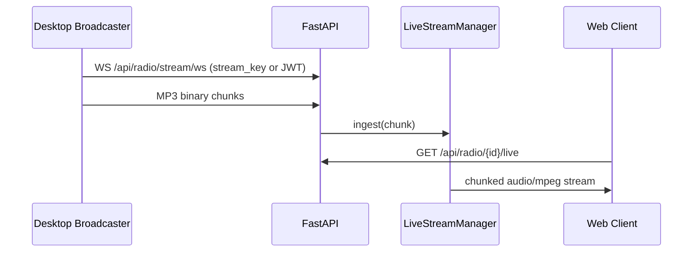
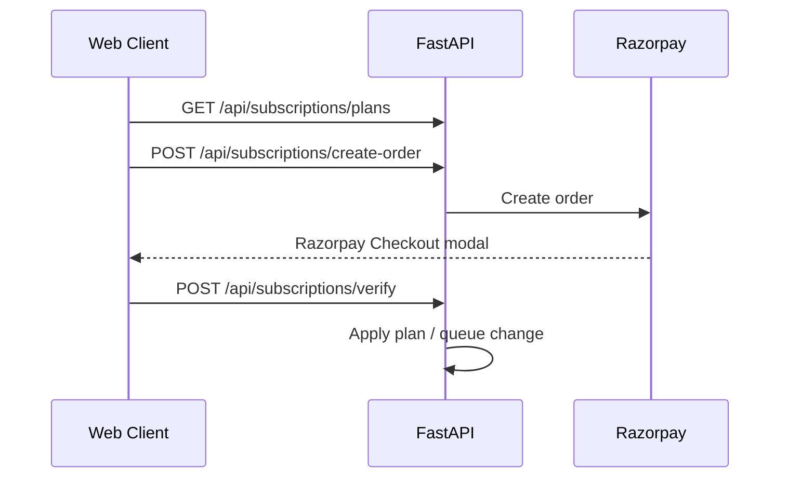
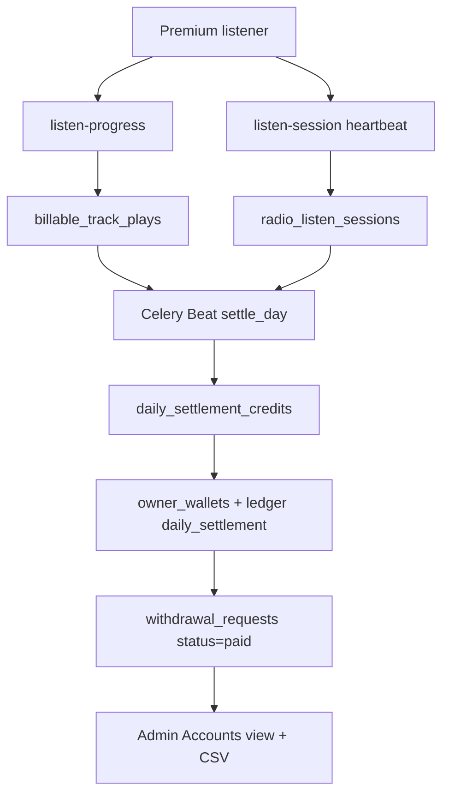

# VeriSonic — Implementation Plan & Technical Spec

Living document describing what is **implemented today**, how the system works, and known gaps. Last aligned with the codebase: **July 2026** (migrations **001–029**).

> **Rebuilding this product?** Start with **[BUILD_GUIDE.md](BUILD_GUIDE.md)** — full layout, feature catalog, APIs, data model, settlement rules, build order, and acceptance checklist.

---

## 1. Product overview

VeriSonic is a full-stack audio platform:

1. **Music catalog** — lossless uploads, automated quality + authenticity analysis, multi-bitrate + per-quality HLS transcoding, ticketed master-stream delivery, optional hybrid AI lyrics
2. **Live radio** — desktop broadcaster ingest, real-time listener delivery, station profiles, program schedules, cover art, program engagement (likes/comments)
3. **Consumer experience** — web player with queue, lyrics, favorites, playlists, like/dislike, threaded comments, unified search, mobile-first navigation, stream quality tiers
4. **Monetization** — free trial + preview limits, Razorpay Premium (INR), admin Unlimited tier, **owner wallets** funded by **daily revenue settlement** (not per-play instant credit), instant self-service withdrawals
5. **Administration** — users/roles/subscriptions, studio & station moderation, **Engagements**, **Accounts** (owners / withdrawals / subscriptions / revenue settings / settle), analytics

---

## 2. Architecture

### 2.1 Why WebSockets for live broadcast (not webhooks)

Webhooks are stateless HTTP callbacks suited for discrete events. Live audio requires a **persistent, low-overhead, bidirectional** channel. The desktop broadcaster streams continuous MP3 frames over WebSocket; the server fans them out to listener queues.



### 2.2 Music processing pipeline

```mermaid
graph LR
    Upload[POST /api/music/upload] --> Analyze[Celery analyze_audio_task]
    Analyze --> Score[Quality + authenticity + spectrogram]
    Score -->|approved| Transcode[Celery transcode_audio_task]
    Transcode --> S3[(MinIO: MP3/AAC + HLS tiers)]
    S3 --> Play[HLS / MP3 / AAC / master]
    Play --> Record[POST listen-progress → billable_track_plays]
    Record --> Settle[Beat settle_daily_revenue_task]
    Settle --> Wallet[owner wallet daily_settlement]
```



Optional: `POST /api/music/{id}/extract-lyrics` → `extract_lyrics_task` → hybrid pipeline → `lyrics` + `lyrics_timed`.

### 2.3 Subscription checkout



### 2.4 Owner wallet & daily settlement (implemented)

Premium subscription revenue is split using **user-centric daily settlement**:

1. During the day, qualifying **premium** listeners generate `billable_track_plays` and `radio_listen_sessions` (seconds only; **no** immediate wallet credit).
2. Celery Beat at **00:30 UTC** runs `settle_daily_revenue_task` for the previous UTC day.
3. For each premium listener: `creator_pool = (plan_price / cycle_days) × owner_share_bps / 10000`, allocated across owners by listen-duration weight.
4. Owners withdraw instantly (`withdrawal_requests.status=paid`). Admins view/export in Accounts; optional `POST /api/admin/revenue/settle`.



**Not billable:** free/trial, unlimited, platform admin, staff in admin role (not listener mode).

### 2.5 Frontend shell

- Hash-based tab routing in `App.tsx` — no React Router for navigation
- Global state: `AuthContext`, `AudioContext` (player, queue, favorites, reactions, quality, radio sessions)
- Layout: `Header` (+ HeaderSearch), `MobileNav`, `AudioPlayer`, `OptionalPanel`
- Engagement UI: like/dislike in player; `CommentThread`; admin `#engagements` (`StudioTracksEngagement`)
- Wallet / Accounts / Subscription components as in BUILD_GUIDE §2.5

See **[BUILD_GUIDE.md](BUILD_GUIDE.md)** for the complete screen map and acceptance checklist.

---

## 3. Backend — implemented

### 3.1 Stack

| Component | Technology |
|-----------|------------|
| API | FastAPI, Uvicorn |
| ORM | SQLAlchemy + PostgreSQL |
| Tasks | Celery worker + Celery beat + Redis |
| Storage | MinIO (S3-compatible); presigned URLs |
| Live audio | WebSocket ingest, HTTP chunked MP3, WebRTC (aiortc) |
| Auth | JWT + Redis refresh tokens, bcrypt |
| Payments | Razorpay Orders API (INR) |
| Encryption | Field-level encryption for bank data (`field_encryption.py`) |
| Optional lyrics | lrclib, LALAL.AI, Google Cloud Speech, Vertex Gemini |

### 3.2 Database models

**Core:** `User`, `SubscriptionPayment`, `Artist`, `Album`, `Genre`, `Track`, `Playlist`, `PlaylistTrack`, `RadioStation`, `RadioSchedule`, `ListeningHistory`, `Favorite`, `AudioAnalysisReport`, `StreamingLog`

**Engagement:** `TrackComment` (with `parent_id`), `CommentReaction`, `TrackReaction`, `RadioProgramReaction`, `RadioProgramComment`, `RadioProgramCommentReaction`

**Revenue / wallet:** `PlatformRevenueSettings`, `OwnerWallet`, `WalletLedgerEntry`, `OwnerBankAccount`, `WithdrawalRequest`, `BillableTrackPlay`, `RadioListenSession`, `DailySettlementRun`, `DailySettlementCredit`

Association table: `track_genres`  
**Migrations:** `backend/app/db/migrations.py` (**001–029**). Full map in BUILD_GUIDE §5.7.

**Notable Track fields:** `hls_normal_path`, `hls_high_path`, `hls_lossless_path`, `hls_hires_path`, `lyrics_timed`, `lyrics_language`, authenticity-related report columns.

**Notable PlatformRevenueSettings:** `daily_settlement_enabled`, `min_valid_daily_listen_seconds`; `studio_pool_bps` / `radio_pool_bps` are legacy (unused by settlement).

### 3.3 API modules

| Prefix | Module | Status |
|--------|--------|--------|
| `/api/auth` | Auth, profile, studio, admin users/studios/engagements | ✅ |
| `/api/music` | Upload, CRUD, quality, listen-progress, comments, lyrics extract, WS | ✅ |
| `/api/radio` | Stations, live, keys, listen sessions, programs, program comments | ✅ partial schedule |
| `/api/reactions` | Track / program / comment like-dislike | ✅ |
| `/api/playlist` | CRUD, reorder | ✅ |
| `/api/favorites` | List, add, remove | ✅ |
| `/api/analytics` | Admin dashboard | ✅ |
| `/api/subscriptions` | Razorpay checkout lifecycle | ✅ (needs keys) |
| `/api/wallet` | Summary, ledger, bank, withdraw, export | ✅ |
| `/api/admin/revenue` | Accounts + settings + settle | ✅ admin only |
| `/api/discovery` | Studios, artist detail, trending, track radio | ✅ |
| `/api/albums`, `/api/genres` | Catalog CRUD | ✅ |

Detailed endpoint tables: BUILD_GUIDE §5.3.

### 3.4 Profile & media uploads

| Entity | Upload endpoint | Storage key pattern |
|--------|-----------------|---------------------|
| User avatar | `POST /api/auth/profile/avatar` | `covers/users/{user_id}{ext}` |
| Studio cover | `POST /api/auth/studio-profile/cover` | `covers/studio/{artist_id}{ext}` |
| Radio cover | `POST /api/radio/{id}/cover` | `covers/radio/{station_id}{ext}` |
| Studio / radio licence | respective POST …/licence-document | `licences/...` |
| Track cover | `PUT /api/music/{track_id}` multipart | `covers/{track_id}{ext}` |

Validation: `upload_validation.py` — images JPG/PNG/WEBP (10 MB); licence PDF/images (10 MB).  
Serialization: `cover_images.py` → presigned URLs; Unsplash fallback for radio when no cover.

### 3.5 Live streaming

| Endpoint | Purpose |
|----------|---------|
| `WS /api/radio/stream/ws` | Broadcaster ingest |
| `GET /api/radio/{id}/live` | HTTP `audio/mpeg` |
| `WS /api/radio/{id}/stream/ws/listener` | WS listener |
| `POST /api/radio/{id}/webrtc/listener` | WebRTC relay |
| Broadcast key get / verify / regenerate | Key lifecycle |
| Listen-session start / heartbeat / end | Accrue seconds for settlement |

`LiveStreamManager`: in-memory queues + ring buffer; optional Redis pub/sub; program/RJ from `programs_list` + timezone.

**No Auto-DJ** when broadcaster offline. External `stream_url` can still mark a station online.

### 3.6 Auth & access control

- Roles: `listener`, `studio_admin`, `radio_admin`, `admin`
- `X-User-Mode: listener` / `POST /auth/switch-mode` for staff browsing as listener
- Rate limit: login/register 10 req/min per IP
- Password policy: 8+ chars, letter + number
- `must_reset_password` → `POST /auth/reset-initial-password`
- Premium gating (`premium.py`): staff bypass; premium/unlimited with valid expiry; free 7-day trial; else 30s/60s preview + AAC 128

### 3.7 Subscriptions

Plans in `subscription_plans.py` (amounts also in `PlatformRevenueSettings`):

| Plan ID | Tier | Cycle | Default INR |
|---------|------|-------|-------------|
| `premium_monthly` | premium | monthly | ₹99 |
| `premium_yearly` | premium | yearly | ₹999 |

`unlimited` = admin-assigned only.

Endpoints: plans, status, create-order, verify, payment-failed, schedule-change, cancel, reactivate, clear-scheduled-change.  
Admin: `PUT /api/auth/admin/users/{id}/subscription`.

### 3.8 Wallet, settlement & Accounts

**Owner `/api/wallet`:** summary, ledger, bank CRUD, instant withdraw, withdrawals list/export/email.

**Admin `/api/admin/revenue`:** summary, owners, subscribers, withdrawals users/detail/export, settings, `POST /settle`, `GET /settle/{date}`.

**Crediting path:**

- `POST /music/{id}/listen-progress` → `process_track_listen_progress` (records only)
- Radio heartbeats → accumulate `total_seconds` (records only)
- Beat / admin settle → `daily_settlement_service.settle_day` → `credit_wallet(..., entry_type=daily_settlement)`

Services: `wallet_service.py`, `daily_settlement_service.py`, `billing_period.py`, `owner_revenue_service.py`, `revenue_settings_service.py`, `accounts_export_service.py`, `withdrawal_export_service.py`, `field_encryption.py`.

**Accounts UI tab order:** Overview → Owners → Withdrawals → Subscriptions → Settings.

### 3.9 Engagement

| Feature | Implementation |
|---------|----------------|
| Track like/dislike | `track_reactions` + `/api/reactions/{track_id}` |
| Comment like/dislike | `comment_reactions` |
| Threaded track comments | `track_comments.parent_id` (one reply level) |
| Radio program like/dislike | `radio_program_reactions` |
| Radio program comments | `radio_program_comments` + reactions |
| Admin Engagements page | `#engagements` → `/api/auth/admin/engagements/accounts` → track/program engagement APIs |
| Studio/radio dashboards | Manage engagement counts + modals |

### 3.10 Celery tasks

1. `analyze_audio_task` — metadata, spectral, spectrogram, quality, authenticity
2. `transcode_audio_task` — MP3/AAC + HLS quality paths
3. `cleanup_old_hls_gens_task` / `queue_missing_hls_retranscodes_task`
4. `extract_lyrics_task` — hybrid lyrics (`lyrics_pipeline.py`)
5. `settle_daily_revenue_task` — Beat schedule `crontab(hour=0, minute=30)` UTC

### 3.11 Hybrid lyrics (optional)

Gated by `LYRICS_EXTRACTION_ENABLED`. Pipeline stages:

1. Online lyrics DB (lrclib)
2. Optional LALAL vocal separation
3. Google Chirp-2 transcription with word timestamps
4. Gemini for scripted / aligned lyrics
5. Forced alignment → LRC + timed JSON

Requires Google credentials mounted at `GOOGLE_APPLICATION_CREDENTIALS` (compose mounts `./cert`).

### 3.12 Tests (CI)

- `tests/test_api_health.py`
- `tests/test_audio_quality.py`
- `tests/test_acoustic_quality.py`
- `tests/test_live_stream_manager.py`
- `tests/test_billing_period_and_settlement.py`

CI: `.github/workflows/backend-tests.yml` on `backend/**` changes.

---

## 4. Frontend — implemented

### 4.1 Pages (tab routes)

| Tab | Page | Notes |
|-----|------|-------|
| `landing` | LandingPage | Marketing + pricing |
| `home` | Home | Feed + recently played + trending |
| `radio` | Radio | Listener tiles or admin dashboard + program engagement |
| `search` | Search | Filters, detail, Play All |
| `favorites` / `playlists` | Favorites / Playlist | API-backed |
| `details` | MusicDetails | Lyrics, threaded comments |
| `profile` | UserProfile | Avatar hover upload |
| `station-profile` / `studio-profile` | Station/Studio or admin management | Role-dependent |
| `settings` | Settings | Quality, subscription, devices |
| `tracks` / `track-list` | TracksManagement / StudioTrackList | Upload + library |
| `engagements` | StudioTracksEngagement | Admin engagement drill-down |
| `users` / `accounts` / `analytics` | Admin pages | Finance + metrics |
| `wallet` | Wallet | Owner earnings |
| `reports` | Inline in App | Acoustic reports |
| `contact` / `broadcaster-download` / `auth` / `admin-password-reset` / `artist` | As named | |

Aliases: `history`→`home`, `discover`→`home`, `studio-tracks-engagement`→`engagements`.

Post-login defaults: `utils/navigation.ts`.

### 4.2 Search

`searchMatch.ts` token ranking; HeaderSearch dropdown; full Search page filters; artists from track metadata; `TrackSearchRow` / `RadioSearchRow`.

### 4.3 Audio player

Mini / expanded mobile; queue & programs panel; lyrics modal / timed lyrics; speed; equalizer; quality tiers; MediaSession; favorites; **like/dislike**; radio billable sessions; premium modal.

### 4.4 Subscriptions UI

Landing + Settings `SubscriptionPlans`; `PremiumModal` + `subscriptionCheckout.ts`; admin tier assignment in UsersManagement.

### 4.5 Route guards

Documented in BUILD_GUIDE §2.2; implemented in `App.tsx` effects.

---

## 5. Desktop broadcaster — implemented

**Location:** `broadcaster/verisonic_broadcaster.py`

| Feature | Status |
|---------|--------|
| Audio device / Connect Live auto-pick | ✅ |
| WebSocket MP3 streaming | ✅ |
| Stream key / JWT auth | ✅ |
| VU meter, status, duration | ✅ |
| Radio-admin-only login | ✅ |
| PyInstaller CI (macOS/Linux/Windows) | ✅ |

Packaging: [broadcaster/distributing_broadcaster.md](broadcaster/distributing_broadcaster.md).

---

## 6. Known gaps & future work

| Area | Gap |
|------|-----|
| Radio schedule | Add-only API; no list/delete/reorder; no automated scheduled playback |
| Playlists | `is_public` stored but no public discovery endpoint |
| Google OAuth | Mock endpoint only; no real token verification |
| Contact mailbox | Upgrade request paths work; general mailbox not online |
| Razorpay | Flow implemented; disabled until keys configured |
| Lyrics | Requires external APIs/credentials; off by default |

---

## 7. Verification checklist

### Live broadcast
1. `docker compose up --build` (confirm **beat** is running)
2. Radio admin registers station → Connection Settings → stream key
3. Run broadcaster → station Live → play in web player

### Music upload
1. Studio admin completes profile → upload lossless → wait for analyze/transcode
2. Approve if needed → play from Home/Search
3. Confirm authenticity fields on quality report

### Settlement
1. Premium listener plays tracks / radio past min thresholds
2. Wait for Beat or `POST /api/admin/revenue/settle`
3. Owner Wallet shows `daily_settlement` ledger credit

### Engagement
1. Like/dislike track in player; comment with reply + reaction
2. Like/comment on radio program
3. Admin `#engagements` shows counts

### Profile / search / wallet / subscriptions
Same as prior checklists in BUILD_GUIDE §10 / README.

### Automated
```bash
cd backend && pytest tests/ -v
```

---

## 8. Default seed data

| Item | Value |
|------|-------|
| Admin email | `admin@verisonic.com` |
| Admin password | `admin12345` (must reset) |
| Admin subscription | `unlimited` |
| Genres | Rock, Electronic, Classical, Jazz, Hip-Hop, Ambient |

---

## 9. File reference (key paths)

| Area | Path |
|------|------|
| API entry | `backend/app/main.py` |
| Celery | `backend/celery_worker.py`, `backend/app/tasks/tasks.py` |
| Migrations | `backend/app/db/migrations.py` |
| Settlement | `backend/app/services/daily_settlement_service.py` |
| Wallet | `backend/app/services/wallet_service.py`, `api/wallet.py` |
| Accounts | `backend/app/api/revenue_admin.py`, `owner_revenue_service.py` |
| Reactions / engagement | `api/reactions.py`, `services/engagement.py`, `radio_engagement.py` |
| Lyrics | `services/lyrics_pipeline.py` |
| Acoustic authenticity | `services/acoustic_quality.py` |
| Live radio | `api/radio.py`, `services/live_stream.py` |
| App shell | `frontend/src/App.tsx`, `utils/navigation.ts` |
| Engagements UI | `frontend/src/pages/StudioTracksEngagement.tsx` |
| Player / audio | `components/player/AudioPlayer.tsx`, `context/AudioContext.tsx` |
| Broadcaster | `broadcaster/verisonic_broadcaster.py` |
