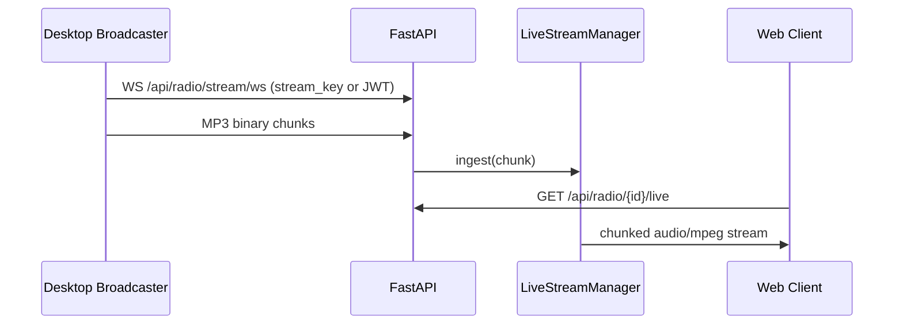
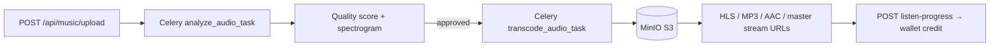
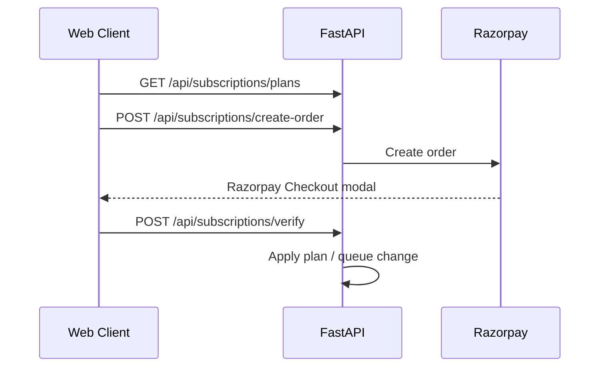
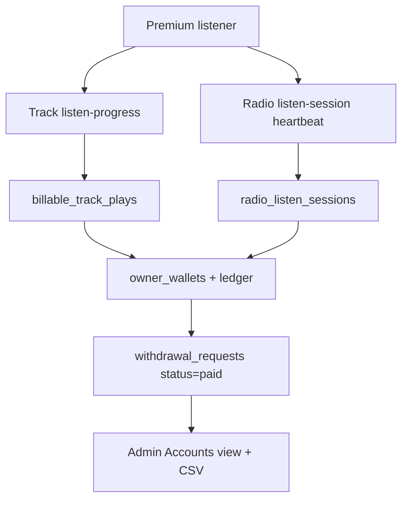

# VeriSonic — Implementation Plan & Technical Spec

Living document describing what is **implemented today**, how the system works, and known gaps. Last aligned with the codebase: **July 2026**.

> **Rebuilding this product?** Start with **[BUILD_GUIDE.md](BUILD_GUIDE.md)** — full layout, feature catalog, APIs, data model, build order, and acceptance checklist so nothing is missed.

---

## 1. Product overview

VeriSonic is a full-stack audio platform:

1. **Music catalog** — lossless uploads, automated quality analysis, multi-bitrate transcoding, HLS VOD playback, ticketed master-stream delivery
2. **Live radio** — desktop broadcaster ingest, real-time listener delivery, station profiles, program schedules, cover art in listings
3. **Consumer experience** — web player with queue, lyrics, favorites, playlists, unified search (header + full page), mobile-first navigation, stream quality tiers
4. **Monetization** — free trial + preview limits, Razorpay checkout for Premium (INR), admin-assigned Unlimited tier, **owner wallet & revenue sharing** with **instant self-service withdrawals**
5. **Administration** — user/role/subscription management, studio & station moderation, **Accounts** (owners / withdrawals / subscriptions / revenue settings + CSV exports), analytics

---

## 2. Architecture

### 2.1 Why WebSockets for live broadcast (not webhooks)

Webhooks are stateless HTTP callbacks suited for discrete events. Live audio requires a **persistent, low-overhead, bidirectional** channel. The desktop broadcaster streams continuous MP3 frames over WebSocket; the server fans them out to listener queues.



### 2.2 Music processing pipeline



### 2.3 Subscription checkout



### 2.4 Owner wallet & revenue (implemented)

Premium subscription revenue is split between platform and content owners (studios + radio). Owners accrue balance from billable track plays and radio listen sessions; they withdraw to bank accounts **instantly** (`status=paid` on create). Platform admins **view and export** withdrawals in Accounts — there is **no** admin approval queue.



### 2.5 Frontend shell

- Hash-based tab routing (`#home`, `#radio`, `#accounts`, …) in `App.tsx` — no React Router
- Global state: `AuthContext` (user, role, admin/listener mode, subscription, route guards), `AudioContext` (player, queue, favorites, quality, radio listen sessions)
- Layout: `Header` (desktop nav + **HeaderSearch** dropdown), `MobileNav`, `AudioPlayer`, `OptionalPanel` (queue/programs)
- Subscription UI: `SubscriptionPlans`, `PremiumModal`, `SubscriptionDates`, `SubscriptionQueueNotice`
- Wallet UI: `Wallet`, `EarningsChart`, `WithdrawModal`, `RevenueSettingsPanel` (admin / Accounts settings)
- Accounts UI: `AccountsManagement` — Overview → Owners → Withdrawals → Subscriptions → Settings

See **[BUILD_GUIDE.md](BUILD_GUIDE.md)** for the complete screen map and acceptance checklist.

---

## 3. Backend — implemented

### 3.1 Stack

| Component | Technology |
|-----------|------------|
| API | FastAPI, Uvicorn |
| ORM | SQLAlchemy + PostgreSQL |
| Tasks | Celery + Redis |
| Storage | MinIO (S3-compatible); presigned URLs for media & uploads |
| Live audio | WebSocket ingest, HTTP chunked MP3, WebRTC (aiortc) |
| Auth | JWT + Redis refresh tokens, bcrypt |
| Payments | Razorpay Orders API (INR) |
| Encryption | Field-level encryption for bank account numbers (`field_encryption.py`) |

### 3.2 Database models (21 tables + `schema_migrations`)

**Core:** `User`, `SubscriptionPayment`, `Artist`, `Album`, `Genre`, `Track`, `Playlist`, `PlaylistTrack`, `RadioStation`, `RadioSchedule`, `ListeningHistory`, `Favorite`, `AudioAnalysisReport`, `StreamingLog`

**Revenue / wallet:** `PlatformRevenueSettings`, `OwnerWallet`, `WalletLedgerEntry`, `OwnerBankAccount`, `WithdrawalRequest`, `BillableTrackPlay`, `RadioListenSession`

Association table: `track_genres`

**Migrations:** custom runner in `backend/app/db/migrations.py` (**001–020**).

| Migration | Summary |
|-----------|---------|
| 001 | Track metadata columns (`cover_image_path`, lyrics, composer, etc.) |
| 002–003 | Radio station core + profile columns |
| 004–005 | Artist/station moderation (`is_active`, reactivation) |
| 006–012 | User subscription, stream quality, queue, activation |
| 013 | Artist profile onboarding fields |
| 014 | Wallet/revenue tables + billable plays + radio listen sessions |
| 015–017 | Encrypted bank accounts; withdrawal payout snapshots |
| 018 | Licence document paths (studio + radio) |
| 019 | Studio cover images (`artists.cover_image_path`) |
| 020 | User profile images (`users.profile_image_path`) |
| 021 | Track comments (`track_comments` table) |

**Notable `User` fields:** `subscription`, `subscription_cycle`, `subscription_expires_at`, `subscription_activated_at`, `pending_plan_id`, `pending_plan_paid`, `subscription_cancel_at_period_end`, `stream_quality`, `must_reset_password`, `profile_image_path`

**Notable `Artist` fields:** `profile_complete`, full address/contact, `licence_document_path`, `cover_image_path`, moderation fields

**Notable `RadioStation` fields:** `cover_art_url` (S3 key), `licence_document_path`, `programs_list`, `timezone`, moderation fields

### 3.3 API modules

| Prefix | Module | Status |
|--------|--------|--------|
| `/api/auth` | Registration, login, refresh, profile, avatar, studio profile, licence/cover uploads, admin users/studios, mode switch, reactivation | ✅ |
| `/api/music` | Upload, CRUD, search, quality, approve, play logging, listen-progress (wallet credit), transcribe, stream ticket + master stream | ✅ |
| `/api/radio` | Stations CRUD, cover/licence uploads, live ingest/playback, broadcast key, WebRTC, schedule add, listen sessions, reactivation | ✅ partial schedule |
| `/api/playlist` | CRUD, add/remove/reorder tracks | ✅ |
| `/api/favorites` | List, add, remove | ✅ |
| `/api/analytics` | Admin dashboard metrics | ✅ |
| `/api/subscriptions` | Plans, Razorpay checkout, verify, schedule change, cancel/reactivate | ✅ (requires Razorpay keys) |
| `/api/wallet` | Summary, ledger, bank account, withdraw, withdrawal export | ✅ |
| `/api/admin/revenue` | Revenue settings, owners, subscribers, withdrawals view/export (Accounts) | ✅ admin only |
| `/api/discovery` | Public studio browse, artist detail (tracks/albums/related) | ✅ |
| `/api/albums`, `/api/genres` | Album list/detail/tracks CRUD (studio admin); genre admin CRUD | ✅ |

### 3.4 Profile & media uploads

| Entity | Upload endpoint | Storage key pattern | Response field |
|--------|-----------------|---------------------|----------------|
| User display picture | `POST /api/auth/profile/avatar` | `covers/users/{user_id}{ext}` | `profile_image_url` (presigned) |
| Studio cover | `POST /api/auth/studio-profile/cover` | `covers/studio/{artist_id}{ext}` | `artist_profile.cover_art_url` |
| Radio station cover | `POST /api/radio/{id}/cover` | `covers/radio/{station_id}{ext}` | `cover_art_url` on station |
| Studio licence doc | `POST /api/auth/studio-profile/licence-document` | `licences/studio/...` | `licence_document_url` |
| Radio licence doc | `POST /api/radio/{id}/licence-document` | `licences/radio/...` | `licence_document_url` |
| Track cover | `PUT /api/music/{track_id}` (multipart) | `covers/{track_id}{ext}` | `cover_art_url` on track |

Validation: `app/core/upload_validation.py` — images JPG/PNG/WEBP (10 MB); licence docs PDF/images (10 MB).

Serialization: `app/services/cover_images.py` resolves S3 keys to presigned URLs; Unsplash fallback for radio listings when no cover set.

### 3.5 Live streaming (implemented)

| Endpoint | Purpose |
|----------|---------|
| `WS /api/radio/stream/ws` | Broadcaster ingest (MP3 chunks) |
| `GET /api/radio/{id}/live` | HTTP listener stream (`audio/mpeg`) |
| `WS /api/radio/{id}/stream/ws/listener` | WebSocket listener |
| `POST /api/radio/{id}/webrtc/listener` | WebRTC relay |
| `GET /api/radio/{id}/broadcast-key` | Fetch current broadcast key |
| `POST /api/radio/{id}/verify-broadcast-key` | Validate key before ingest |
| `POST /api/radio/{id}/regenerate-key` | Rotate stream key (time-limited) |
| `POST /api/radio/{id}/listen-session/start` | Start billable radio session (premium) |
| `POST /api/radio/{id}/listen-session/heartbeat` | Accrue listen time + wallet credit |
| `POST /api/radio/{id}/listen-session/end` | End session |

`LiveStreamManager` (`app/services/live_stream.py`):
- In-memory listener queues + chunk ring buffer
- Optional Redis pub/sub for multi-instance fan-out
- Listener count aggregation
- Dynamic program/RJ from `programs_list` JSON + station timezone

**Intentional behavior:** No Auto-DJ / scheduled track playback when broadcaster is offline. External `stream_url` can still mark a station online.

### 3.6 Auth & access control

- Roles: `listener`, `studio_admin`, `radio_admin`, `admin`
- Header `X-User-Mode: listener` for staff browsing as listener
- Rate limit: login/register 10 req/min per IP
- Password policy: 8+ chars, letter + number
- Mandatory first-login reset: `must_reset_password` → `POST /api/auth/reset-initial-password`
- Premium gating (`app/core/premium.py`):
  - Staff roles (`admin`, `studio_admin`, `radio_admin`) always have premium access
  - `premium` / `unlimited` with valid `subscription_expires_at`
  - `free` users get a **7-day trial** from account creation
  - Non-premium: 30s track preview, 60s radio preview, AAC 128 only

### 3.7 Subscriptions (implemented)

Plans defined in `app/core/subscription_plans.py` (amounts also configurable via `PlatformRevenueSettings`):

| Plan ID | Tier | Cycle | Default price (INR) |
|---------|------|-------|---------------------|
| `premium_monthly` | premium | monthly | ₹99 |
| `premium_yearly` | premium | yearly | ₹999 |

`unlimited` is admin-assigned only (no self-service checkout).

| Endpoint | Purpose |
|----------|---------|
| `GET /api/subscriptions/plans` | Public plan catalog |
| `GET /api/subscriptions/status` | Current user subscription state |
| `POST /api/subscriptions/create-order` | Create Razorpay order |
| `POST /api/subscriptions/verify` | Verify payment signature, activate plan |
| `POST /api/subscriptions/payment-failed` | Mark failed checkout |
| `POST /api/subscriptions/schedule-change` | Queue plan change at period end |
| `POST /api/subscriptions/cancel` | Cancel at period end |
| `POST /api/subscriptions/reactivate` | Undo pending cancellation |
| `POST /api/subscriptions/clear-scheduled-change` | Clear queued plan change |

Admin override: `PUT /api/auth/admin/users/{user_id}/subscription`

Requires `RAZORPAY_KEY_ID` and `RAZORPAY_KEY_SECRET` in environment.

### 3.8 Wallet & revenue (implemented)

**Owner endpoints** (`/api/wallet`):

| Endpoint | Purpose |
|----------|---------|
| `GET /wallet/summary` | Balance, earnings breakdown |
| `GET /wallet/ledger` | Ledger entries |
| `GET/PUT/DELETE /wallet/bank-account` | Saved bank details (encrypted at rest) |
| `POST /wallet/withdraw` | Instant withdrawal (`status=paid`) |
| `GET /wallet/withdrawals` | Withdrawal history |
| `GET /wallet/withdrawals/export.csv` | CSV export |
| `POST /wallet/withdrawals/export/email` | Email CSV export |

**Admin endpoints** (`/api/admin/revenue`):

| Endpoint | Purpose |
|----------|---------|
| `GET/PUT /admin/revenue/settings` | Premium prices, revenue split BPS, min listen thresholds |
| `GET /admin/revenue/owners` (+ `/export.csv`, `/{id}`, `/{id}/export.csv`) | Owner accounts list/detail CSV |
| `GET /admin/revenue/subscribers` (+ export / detail / detail export) | Subscriber list/detail; detail supports `from`/`to`/`search` |
| `GET /admin/revenue/withdrawals/users` (+ `export.csv`) | Owners with withdrawal activity |
| `GET /admin/revenue/withdrawals/users/{id}` (+ `export.csv`) | Paid withdrawals; `from`/`to`/`search`; CSV includes opening balance when From set |
| `GET /admin/revenue/withdrawals` | Completed (`paid`) withdrawals (legacy list) |

**Crediting:**
- `POST /api/music/{id}/listen-progress` — billable track play when listened seconds ≥ `min_track_seconds`
- Radio listen-session heartbeats — billable when session active and premium listener (row-locked)

Services: `wallet_service.py`, `revenue_settings_service.py`, `accounts_export_service.py`, `withdrawal_export_service.py`, `field_encryption.py`

**Frontend Accounts tab order:** Overview → Owners → Withdrawals → Subscriptions → Settings.

### 3.9 Celery tasks

1. **`analyze_audio_task`** — FFprobe metadata, librosa spectral analysis, spectrogram PNG, quality scoring, auto-reject rules
2. **`transcode_audio_task`** — MP3 320, AAC 256/128, HLS VOD segments → S3

### 3.10 Tests (CI)

- `tests/test_api_health.py`
- `tests/test_audio_quality.py`
- `tests/test_live_stream_manager.py`

---

## 4. Frontend — implemented

### 4.1 Pages (tab routes)

| Tab | Page | Notes |
|-----|------|-------|
| `landing` | LandingPage | Marketing, pricing (`SubscriptionPlans`), featured content |
| `home` | Home | Feed; **Popular Artists** → Search with artist selected |
| `radio` | Radio | Listener tiles; admin dashboard & registration |
| `search` | Search | Full search: tracks → albums → radio → artists → playlists; detail views + Play All |
| `favorites` | Favorites | API-backed favorites list |
| `playlists` | Playlist | CRUD, drag-reorder, mobile drill-down |
| `details` | MusicDetails | Track detail, lyrics, share |
| `profile` | UserProfile | Display name, email, password; **hover-to-upload avatar** on initials circle |
| `station-profile` | StationProfile | Radio admin: station CRUD, cover, licence doc |
| `studio-profile` | StudioProfile | Studio onboarding, cover, licence doc, reactivation appeals |
| `settings` | Settings | Quality, subscription, audio output; **RevenueSettingsPanel** for admin |
| `tracks` | TracksManagement | Upload queue, approval, acoustic reports |
| `track-list` | StudioTrackList | Studio admin track library |
| `users` | UsersManagement | Admin user CRUD + subscription assignment |
| `accounts` | AccountsManagement | Admin finance: owners, withdrawals, subscriptions, settings + CSV |
| `analytics` | AdminAnalytics | Metrics dashboard |
| `wallet` | Wallet | Owner earnings, chart, instant withdraw, bank account |
| `reports` | Inline in App | Acoustic report viewer |
| `contact` | Contact | Support & upgrade requests |
| `broadcaster-download` | BroadcasterDownload | Desktop app download guide |
| `artist` | Artist | Dedicated artist browse (`GET /api/discovery/artists/{name}`) |
| `admin-password-reset` | ForceAdminPasswordReset | Mandatory admin password change gate |

**Role-specific profile tabs (same route, different component):**
- `station-profile` → `RadioStationsManagement` for platform **admin**; `StationProfile` for **radio_admin**
- `studio-profile` → `StudiosManagement` for platform **admin**; `StudioProfile` for **studio_admin**

**Artist page** (`Artist.tsx`):
- Routed via `#artist` tab; opened from Search, Header search, Music Details, Home Popular Artists
- Fetches `GET /api/discovery/artists/{name}` — tracks, albums, studio bio/cover, related artists
- Play All queue support; studio cover shown in hero when artist matches a studio profile

**Not wired:** `Sidebar.tsx` (legacy; navigation uses Header + MobileNav).

### 4.2 Search (implemented)

**Shared utilities:** `frontend/src/utils/searchMatch.ts`
- Token-based scoring with weights, fuzzy subsequence match, diacritic normalization
- Artists derived from **track metadata** (`artist_name` / `artist_name_override`), not studio `Artist` profiles
- Album candidates built from track `album_title`

**Header search** (`HeaderSearch.tsx`):
- Debounced dropdown preview (does not navigate on first keystroke)
- Flat merged ranking: tracks, albums, radio, artists, playlists (playlists when logged in)
- “Search all” link → full `#search` page
- Hidden on `#search` tab and in staff **admin mode**

**Full search page** (`Search.tsx`):
- Filter chips: All, Tracks, Albums, Radio, Artists, Playlists
- Result order: tracks → albums → radio → artists → playlists
- Detail views: artist tracks, album tracks, playlist tracks
- **Play All** on list rows and detail headers
- Unified row components: `TrackSearchRow`, `RadioSearchRow` (frequency subtitle, station cover)

**Backend:** `GET /api/music` search includes `Track.artist_name_override`.

### 4.3 Profiles & covers (UI)

| Surface | Component | UX |
|---------|-----------|-----|
| My Profile avatar | `ProfileAvatarUpload` | Initials circle; hover → camera icon → upload image |
| Studio cover | `CoverImageUpload` in `StudioProfile` | Upload/replace in Core Info (after profile saved) |
| Radio cover | `CoverImageUpload` in `StationProfile` | Upload on station **edit** (save station first on create) |
| Licence docs | `LicenceDocumentUpload` | Studio + station profile forms |
| Listings | `RadioCard`, `RadioSearchRow` | `station.cover_art_url` with presigned URL or fallback |

### 4.4 Audio player

| Feature | Desktop | Mobile |
|---------|---------|--------|
| Mini player bar | Fixed bottom overlay | In-flow above bottom nav |
| Expanded player | — | Full-screen deck, browser back to dismiss |
| Queue / Programs panel | Right drawer | Full-screen bottom sheet |
| Lyrics | Modal | Tap cover → overlay in expanded player |
| Speed control | Select dropdown | Chevrons + tap speed to reset 1× |
| Visualizer | Canvas spectrum (`Equalizer`) | — |
| Live radio sync | 24h seek bar, edge sync | Same |
| Stream quality | normal / high / hires / lossless (paid) | Same |
| Audio output device | Settings picker (where supported) | — |
| Radio billable sessions | Heartbeat while playing live station | Same |

Lossless/hi-res playback uses short-lived stream tickets (`POST /api/music/{id}/stream/ticket` → `GET /api/music/{id}/stream/master`).

### 4.5 Subscriptions UI

- **LandingPage** and **Settings** embed `SubscriptionPlans`
- **PremiumModal** opens Razorpay Checkout inline (via `subscriptionCheckout.ts`)
- Supports immediate upgrade, queued plan changes, cancel-at-period-end, reactivation
- **UsersManagement** shows subscription tier and dates; admin can assign tiers

### 4.6 Mobile UI patterns

- **Header:** compact logo, centered page title, user menu (generic icon); search when not on search tab
- **Bottom nav:** Home, Radio, Search, Favorites, Playlists (role-aware)
- **Home feed:** horizontal scroll strips; trending grids; clickable popular artists
- **Radio (listener):** compact tiles — name + frequency, cover art, location
- **Notifications:** banner toasts; Swal for confirmations
- **Track lists:** full-width `TrackRow` / `TrackSearchRow`

### 4.7 Route guards

- Unauthenticated → `landing`
- `must_reset_password` → `admin-password-reset` (blocks all other tabs)
- `radio_admin` without station → restricted tabs until station registered (**admin mode**)
- `studio_admin` in admin mode → onboarding until `profile_complete`; then track-list/tracks/wallet
- Admin mode → playlists disabled; library playback stopped; header search hidden
- `settings` → requires listen mode or listener/admin role (`canAccessPlatformSettings`)
- `station-profile` → admin or radio_admin in admin mode
- `wallet` → studio_admin / radio_admin in admin mode

---

## 5. Desktop broadcaster — implemented

**Location:** `broadcaster/verisonic_broadcaster.py` (PyQt5 primary UI, Tkinter fallback)

| Feature | Status |
|---------|--------|
| Audio device selection | ✅ |
| WebSocket MP3 streaming | ✅ |
| Stream key / JWT auth | ✅ |
| VU meter, status, duration | ✅ |
| Radio-admin-only login | ✅ |
| PyInstaller CI builds (macOS, Linux, Windows) | ✅ `.github/workflows/build-broadcaster.yml` |

---

## 6. Known gaps & future work

| Area | Gap |
|------|-----|
| Radio schedule | Add-only API; no list/delete/reorder; no automated scheduled playback |
| Playlists | `is_public` stored but no public discovery endpoint |
| Google OAuth | Mock endpoint only; no real token verification |
| Razorpay | Full flow implemented; disabled until server keys are configured |

---

## 7. Verification checklist

### Live broadcast
1. Start stack: `docker compose up --build`
2. Log in as radio admin, register a station
3. Open Connection Settings → copy stream key
4. Run `python broadcaster/verisonic_broadcaster.py`, authenticate, start broadcast
5. Confirm station shows **Live** in dashboard; play station in web player

### Music upload
1. Promote user to studio admin
2. Complete studio profile (admin mode onboarding)
3. Upload lossless file via Tracks Management
4. Wait for Celery analysis + transcode
5. Approve track (admin) if not auto-approved
6. Play from Home or Search

### Profile & covers
1. **My Profile** — hover initials → camera → upload display picture
2. **Studio Profile** — save profile → upload Studio Cover
3. **Station Profile** — edit station → upload Station Cover
4. Confirm radio cover appears in Radio browse and Search results

### Search
1. Type in header search → dropdown preview without leaving page
2. Click “Search all” → full search page with filters
3. Click Popular Artist on Home → search opens with artist detail
4. Verify Play All on artist/album/playlist detail views

### Wallet (studio/radio admin)
1. Log in as studio or radio admin (admin mode)
2. Open **My Wallet** — view balance and earnings chart
3. Save bank account, request withdrawal
4. As platform admin: Settings → Revenue settings; process withdrawal in admin revenue API/UI

### Subscription checkout (requires Razorpay keys)
1. Set `RAZORPAY_KEY_ID` and `RAZORPAY_KEY_SECRET`
2. Log in as listener, open Settings or Premium modal
3. Complete Razorpay test checkout
4. Confirm tier badge updates and full playback unlocked

### Automated
```bash
cd backend && pytest tests/ -v
```

---

## 8. Default seed data

| Item | Value |
|------|-------|
| Admin email | `admin@verisonic.com` |
| Admin password | `admin12345` (must reset on first login) |
| Admin subscription | `unlimited` (auto-applied on seed/sync) |
| Genres | Rock, Electronic, Classical, Jazz, Hip-Hop, Ambient |

---

## 9. File reference (key paths)

| Area | Path |
|------|------|
| API entry | `backend/app/main.py` |
| Radio + live stream | `backend/app/api/radio.py`, `backend/app/services/live_stream.py` |
| Music + upload | `backend/app/api/music.py`, `backend/app/tasks/tasks.py` |
| Wallet + revenue | `backend/app/api/wallet.py`, `backend/app/api/revenue_admin.py`, `backend/app/services/wallet_service.py` |
| Subscriptions | `backend/app/api/subscriptions.py`, `backend/app/services/subscription_service.py`, `backend/app/services/razorpay_service.py` |
| Uploads (cover/licence) | `backend/app/services/cover_images.py`, `backend/app/services/licence_documents.py`, `backend/app/core/upload_validation.py` |
| Premium gating | `backend/app/core/premium.py`, `backend/app/core/subscription_plans.py` |
| Migrations | `backend/app/db/migrations.py` |
| App router | `frontend/src/App.tsx` |
| Search | `frontend/src/pages/Search.tsx`, `frontend/src/components/layout/HeaderSearch.tsx`, `frontend/src/utils/searchMatch.ts` |
| Profiles | `frontend/src/pages/UserProfile.tsx`, `StudioProfile.tsx`, `StationProfile.tsx` |
| Profile avatar upload | `frontend/src/components/shared/ProfileAvatarUpload.tsx` |
| Cover/licence upload UI | `frontend/src/components/shared/CoverImageUpload.tsx`, `LicenceDocumentUpload.tsx` |
| Player | `frontend/src/components/player/AudioPlayer.tsx` |
| Audio state | `frontend/src/context/AudioContext.tsx` |
| Auth state | `frontend/src/context/AuthContext.tsx` |
| Wallet UI | `frontend/src/pages/Wallet.tsx`, `frontend/src/utils/wallet.ts` |
| Revenue admin UI | `frontend/src/pages/RevenueSettings.tsx` |
| Subscription checkout | `frontend/src/utils/subscriptionCheckout.ts`, `frontend/src/components/subscription/SubscriptionPlans.tsx` |
| Stream quality | `frontend/src/utils/streamQuality.ts` |
| Banner notifications | `frontend/src/components/shared/BannerHost.tsx`, `frontend/src/utils/banner.ts` |
| Broadcaster | `broadcaster/verisonic_broadcaster.py` |
